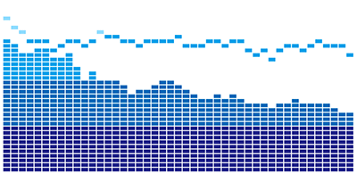

# pon-audio-spectrum
[日本語](./README.md)

Audio spectrum visualizer for web audio (with [howler.js](https://howlerjs.com/)).

## Getting Started

```html
<!DOCTYPE html>
<html lang="ja">
<head></head>
<body>
  <div id="container"></div>
  <button id="play">Play</button>
  <script src="https://cdnjs.cloudflare.com/ajax/libs/howler/2.1.2/howler.js"></script>
  <script src="pon-audio-spectrum.js"></script>
  <script>
    // Create Howler audio.
    const howl = new Howl({ src: "audio.mp3", autoplay: false });

    // Create PonAudioSpectrum with options, and set audio.
    const options = {}
    const pas = new PonAudioSpectrum(PonAudioSpectrum.VisualizerType.Solid, options);
    pas.setAudio(howl);

    // Add PonAudioSpectrum's canvas to DOM, and start draw loop.
    document.getElementById("container").appendChild(pas.canvas);
    window.setInterval(() => {
      pas.draw();
    }, 1 / 60);

    // Play audio
    document.getElementById("play").addEventListener("click", () => {
      howl.play();
    })
  </script>
</body>
</html>
```

## Visualizer Types

### Solid

```javascript
new PonAudioSpectrum(PonAudioSpectrum.VisualizerType.Solid, {});
```


### Block

```javascript
new PonAudioSpectrum(PonAudioSpectrum.VisualizerType.Block, {});
```



## Options

### Options of Solid

| OPTION | TYPE | DEFAULT | DESCRIPTION |
|--------|------|---------|-------------|
| fftSize       | number | 128 | Fast Fourier Transform (FFT) size. Ref: [AnalyserNode.fftSize](https://developer.mozilla.org/en-US/docs/Web/API/AnalyserNode/fftSize) |
| barWidth      | number | 15 | Bar width |
| barHeight     | number | 400 | Bar height |
| margin        | number | 2 | Margin between lines. |
| colors        | Array\<string\>| ["#1d2088", "#8edcff"] | Line color. If multiple colors are specified, it be a gradation. |
| gradientStops | Array\<number\> | null | Color stop of gradient. |

### Options of Block

| OPTION | TYPE | DEFAULT | DESCRIPTION |
|--------|------|---------|-------------|
| fftSize     | number | 128 | Fast Fourier Transform (FFT) size. Ref: [AnalyserNode.fftSize](https://developer.mozilla.org/en-US/docs/Web/API/AnalyserNode/fftSize) |
| blockWidth  | number | 15 | width of block |
| blockHeight | number | 8  | height of block |
| blockCount  | number | 40 | count of blocks |
| marginh     | number | 2  | Horizontal margin between blocks. |
| marginv     | number | 2  | Vertical margin between blocks. |
| colors      | Array\<string\> | ["#1d2088", "#0068b7", "#00a0e9", "#8edcff"] | block colors |
| colorSteps  | Array\<number\> | [10, 20, 30, 40] | steps of colors |
